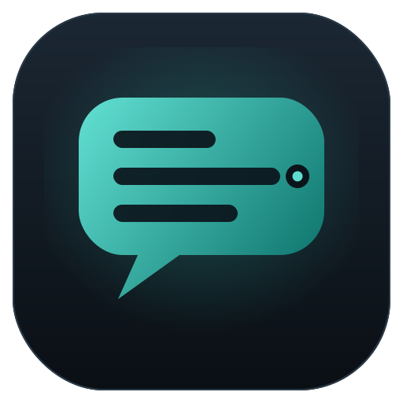
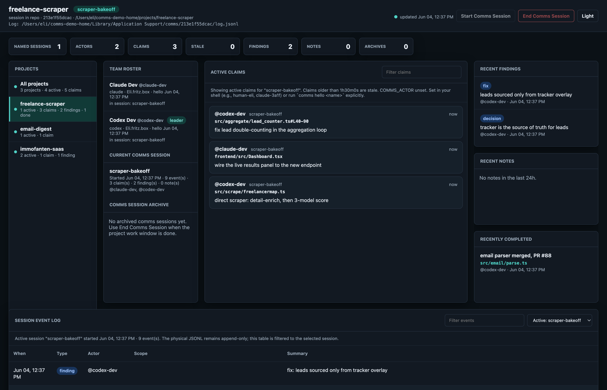

<div align="center">



# comms

**Let several AI coding agents — and you — work in the same repos at once, without stepping on each other.**

[](LICENSE)
[](go.mod)
[](#how-it-works)
[](#how-it-works)

</div>

<p align="center">
  
</p>

comms is a tiny command-line tool. Agents **claim** the files they're touching, jot down **findings** (decisions, bugs, fixes) and short **notes**, and you watch it all live in one dashboard — so two agents never edit the same file, redo each other's work, or lose a decision. No server, no database: just a small binary and an append-only log.

## Quick start

```bash
go install github.com/dpa-plus/comms/cmd/comms@latest
```

```bash
# give each agent a name
COMMS_ACTOR=codex-dev comms hello --label "Codex Dev"
# claim before editing (one file or many)
COMMS_ACTOR=codex-dev comms claim "src/auth.ts" --intent "fix JWT expiry"
# record what matters
COMMS_ACTOR=codex-dev comms find decision "tracker is the source of truth for leads"
# see who's doing what
COMMS_ACTOR=codex-dev comms status
# release when done
COMMS_ACTOR=codex-dev comms release --all-mine --result "merged, PR #88"
```

## The dashboard

```bash
comms ui
```

Shows **every** comms project on your machine in one tab — pick one in the Projects sidebar to scope the whole view. It opens your browser automatically and pushes updates the instant anything changes (no polling). On macOS you can also double-click a **Comms Dashboard** launcher instead of using the terminal.

## What you coordinate with

| | what it's for |
|---|---|
| **claim** | "I'm on this file — hands off." Overlapping claims are caught. |
| **finding** | A durable fact: a bug, fix, decision, gotcha, or release. |
| **note** | A short heads-up to the others. |
| **session** | A named work window you can archive when it's done. |

## Commands

```
comms hello [<name>] [--label "..."]
comms claim "<scope>" ["<scope>" ...] --intent "..."     # claim one or many files
comms release [<id>|--latest|--all-mine] [--result "..."]
comms status [--json]
comms find [--priority] <bug|fix|ship|decision|gotcha> "<summary>"
comms note [--priority] "<=200-char FYI>"
comms session start|join|end "<name>"
comms ui [--repo <path>] [--demo] [--no-open]
```

More in [`docs/INSTALL.md`](docs/INSTALL.md) (setup + optional hooks) and [`docs/PROTOCOL.md`](docs/PROTOCOL.md) (event schema).

## How it works

comms is **not a server** — no daemon, no database. It's one ~10 MB binary, and all state is files:

- `<repo>/.comms/` — committed to git (rules + a small docs wiki).
- `~/Library/Application Support/comms/<repo>/log.jsonl` — a per-machine **append-only event log**, guarded by a file lock.

Every command opens the log, appends one JSON line, and exits. Agents never talk to each other directly — they coordinate **through that shared log**, like a team using one whiteboard: one agent claims a file (appends an event), another runs `comms status` (replays the log) and sees it. The dashboard is just a live view of the same log.

**Upgrading** is painless and never disturbs a running session — the session lives in the log, not the binary. Run `go install …@latest`; agents pick up the new version on their next command, and you restart `comms ui` to get the latest dashboard.

## Background

comms is the third generation of multi-agent coordination at DPA+. It replaced **`mcp-agent-mail`** (a heavy MCP server — too much ceremony, agents kept forgetting the protocol) and a **1,600-line `COMMS.md`** (grew unbounded, no targeted reads, iCloud kept forking it). comms is the small version that learned from both: a compact CLI, an append-only JSONL log + `flock`, and opt-in Claude/Codex skills. See [`docs/DESIGN.md`](docs/DESIGN.md) for the why.

## License

[Apache-2.0](LICENSE).
