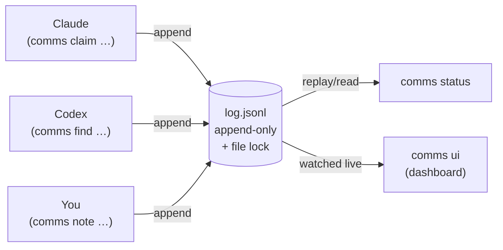

<div align="center">


# comms

**Coordinate parallel coding agents through one shared, append-only log.**

[](LICENSE)
[](go.mod)
[](#how-it-actually-runs-on-your-machine)
[](#how-it-actually-runs-on-your-machine)

</div>

> **comms is a tiny command-line tool that lets several AI coding agents — and you — work in the same repository at the same time without stepping on each other.**

<p align="center">
  
</p>

<p align="center"><em>The unified dashboard (<code>comms ui</code>) — every project in one tab. Pick one in the Projects sidebar to scope the whole view; it's pushed to your browser the instant anything changes.</em></p>

---

## The problem it solves

Modern coding often means running **more than one AI agent on the same codebase at once** — say Claude in one window and Codex in another, plus you. That's powerful, but they're effectively three people editing the same project with no shared awareness:

- 🥊 **They collide.** Two agents edit the same file and overwrite each other's work.
- 🔁 **They repeat each other.** One agent fixes a bug the other already fixed.
- 🧠 **They forget context.** A decision ("the tracker is the source of truth for leads") lives in one agent's head and is lost to the others.
- 🌫️ **You can't see what's happening.** Who's working on what, right now?

These are the classic problems of people working in parallel — and the classic answer is to **write things down in one shared place.** comms is that shared place, built for agents: small enough that they actually use it, with a live view so *you* can watch.

> This is the **third generation** of multi-agent coordination at DPA+. The first was a single 1,632-line `COMMS.md` markdown file — it worked, but grew without bound, had no targeted reads, relied on agents remembering to update it, and iCloud sync kept forking the file. The second was `mcp-agent-mail` — a heavy MCP server with severity ladders and seven identities; too much ceremony, and agents kept forgetting the protocol. **comms is the small version that learned from both.**

---

## What comms gives you

| Primitive | What it's for | Example |
|---|---|---|
| **Claim** | "I'm working on this file — hands off." | `comms claim "src/auth.ts" --intent "fix JWT expiry"` |
| **Finding** | A durable fact: a bug, a fix, a decision, a gotcha, a release. | `comms find decision "tracker is source of truth for leads"` |
| **Note** | A short, throwaway heads-up. | `comms note "FYI: schema migration coming next"` |
| **Session** | A named work window that groups claims/events and can be archived. | `comms session start "dashboard fixes"` |
| **Doc** | A small per-repo wiki under `.comms/docs`. | `comms doc tracker-architecture` |
| **Lesson** | Cross-project knowledge that outlives any one repo. | `comms lesson verify-data-before-ui` |

Before an agent edits a file it **claims** it. Before it forgets a decision it records a **finding**. Another agent (or you) runs `comms status` and instantly sees the whole picture. The first active participant becomes a lightweight **leader** whose only extra power is pinning `--priority` notes to the top.

---

## How it actually runs on your machine

The most important thing to understand: **comms is not a server.** There's no daemon, no background process, no network service, no database to install. It is **one small, self-contained Go binary** (~10 MB) sitting on your `PATH`.

**Everything is files.** State lives in two places:

```
your-repo/.comms/                         ← committed to git (shared design)
  ├─ policy.txt                            ← optional rules (which paths need claims)
  └─ docs/                                 ← the per-repo wiki

~/Library/Application Support/comms/<repo-hash>/   ← per-machine, NOT in git
  ├─ log.jsonl                             ← the append-only event log (the heart)
  └─ .lock                                 ← a file lock that serializes writes
```

> The per-machine log lives outside iCloud on purpose — iCloud Drive forks files that two processes append to at the same time, which would corrupt the log.

**Every command is the same tiny dance.** When an agent runs `comms claim …`:

1. The binary **starts**, figures out which repo you're in, and finds that repo's `log.jsonl`.
2. It grabs the **file lock** (so two agents can't write at the same instant).
3. It **appends one line** — a JSON event — to the end of the log.
4. It **releases the lock and exits.**

That's it. A `comms` command is a short-lived program that opens a file, appends a line, and quits. Reading state (`comms status`) just replays the log — no lock needed.



---

## How the agents actually communicate

Here's the key idea: **the agents never talk to each other directly.** There's no chat, no messages flying between them, no network connection. They communicate the way a team uses a shared whiteboard:

- **Agent A writes to the board.** `comms claim "aggregate.ts"` appends a *claim* event to the log.
- **Agent B reads the board.** `comms status` replays the log and sees A's claim — so B knows to work elsewhere.
- **Conflicts are caught by reading, not messaging.** If B tries to claim a file that overlaps A's claim, comms sees the overlap in the log and tells B to back off.
- **Stale claims can be taken over.** A claim goes **stale after 1 hour idle** — its holder is presumed gone. The `BLOCKED` message says so, and B can steal a stale claim directly (`comms claim … --steal <id>`, no `--reason`). A still-active claim (held < 1h) requires the user's confirmation and a `--reason` to steal.

The log is the single source of truth. It's **append-only**, so history is never rewritten — you can always see exactly who did what and when. This "shared ledger" model is what makes coordination reliable without any of the agents needing to know the others exist. They only need to know about **the log**.

The dashboard (`comms ui`) is simply a **live read-only view** of that same log.

---

## The live dashboard

```bash
COMMS_ACTOR=human-you comms ui   # http://127.0.0.1:7878 — every project, one tab
```

> **Set `COMMS_ACTOR` to run it as an operator.** The dashboard's write actions — **Release** a claim, **Remove** (retire) a crashed agent, **End** a session — are attributed to you, so they only appear when `COMMS_ACTOR` is set to a real operator name (e.g. `human-you`; the bare names `eli/claude/codex/agent/user` are reserved). Run `comms ui` with it unset and the dashboard is **read-only** and those buttons stay hidden — set it and they appear.

`comms ui` is **unified by default**: it shows *every* comms project on this machine in one window. A **Projects sidebar** on the left lists each project (and its sessions); click one and the whole dashboard — team roster, active claims (stale ones flagged), recent findings and notes, and the per-session event log — scopes to it. Run it **once** and watch all your agents across every repo, switching between them in the same tab. No starting a UI per project, and agents never have to "open" anything — they just write to their logs, which this one dashboard already sees.

It updates by **push, not polling.** A file watcher inside `comms ui` is notified by the operating system the instant any project's `log.jsonl` changes; it rebuilds the snapshot once and streams it to every open browser tab over [Server-Sent Events](https://developer.mozilla.org/en-US/docs/Web/API/Server-sent_events). So when any agent anywhere appends an event, the right project lights up in the sidebar **immediately**, and your laptop isn't burning cycles re-reading logs on a timer.

Every snapshot carries the server's **front-end build fingerprint**, and the page remembers the one it loaded with. So when you replace the binary and restart `comms ui`, every open tab notices the new build on the next push and **reloads itself** to the new dashboard — no more stale UI lingering after an upgrade.

It **opens your browser automatically** when run interactively (`--no-open` to suppress). On macOS you can also double-click a **Comms Dashboard** launcher instead of using the terminal. The header shows the active **session name** (the name agents use, e.g. `acme-build`) next to the repo.

- `comms ui --repo /path/to/repo` — scope to a single repo (no sidebar).
- `comms ui --demo` — explore with sample data (read-only; writes nothing real).

### Run the dashboard as a login service (macOS)

So the dashboard is always up — survives reboots, and is restarted automatically if it ever exits — install it as a per-user `launchd` agent. The template sets `COMMS_ACTOR` (so the operator buttons work — see the note above); change it from `operator` to your own name first:

```bash
# Set your operator name (and point at your binary if it is not Homebrew, `which comms`):
#   sed -i '' "s#<string>operator</string>#<string>human-you</string>#" contrib/launchd/plus.dpa.comms-ui.plist
install -m644 contrib/launchd/plus.dpa.comms-ui.plist ~/Library/LaunchAgents/
launchctl bootstrap "gui/$(id -u)" ~/Library/LaunchAgents/plus.dpa.comms-ui.plist
```

After installing a new binary, restart the service to pick it up (open tabs then auto-reload, see above):

```bash
launchctl kickstart -k "gui/$(id -u)/plus.dpa.comms-ui"
```

To remove it: `launchctl bootout "gui/$(id -u)/plus.dpa.comms-ui"` then delete the plist.

---

## Quick start

```bash
# Install (single binary, nothing else)
go install github.com/dpa-plus/comms/cmd/comms@latest

# In desktop-app / manual use, prefix commands with a concrete actor name:
COMMS_ACTOR=codex-dev comms hello --label "Codex Dev"
COMMS_ACTOR=codex-dev comms session start "dashboard fixes" --label "Codex Dev"
COMMS_ACTOR=codex-dev comms status
COMMS_ACTOR=codex-dev comms claim "src/foo.ts" --intent "fix bug"
COMMS_ACTOR=codex-dev comms note --priority "Stop editing aggregation until my claim clears."
```

If a desktop app loses macOS access to its working directory, run `comms` from a safe directory and point it at the repo explicitly:

```bash
COMMS_ACTOR=claude-dev comms --repo /Users/you/code/my-project status
# or for one shell:
export COMMS_REPO=/Users/you/code/my-project
COMMS_ACTOR=claude-dev comms status
```

See [`docs/INSTALL.md`](docs/INSTALL.md) for manual + optional automated (hook/skill) setup, [`docs/PROTOCOL.md`](docs/PROTOCOL.md) for the event schema, and [`docs/DESIGN.md`](docs/DESIGN.md) for the *why*.

---

## Teach your agents to use it

comms ships a **skill** — [`skills/using-comms/SKILL.md`](skills/using-comms/SKILL.md) — that teaches an AI agent the protocol: when to `claim`, what to record as a `finding`, how to coordinate, and how to recover. There's one for **Claude** and one for **Codex** — the same file works for both (they share the skill format), so install it for whichever agents you run:

```bash
cp -r skills/using-comms ~/.claude/skills/    # Claude
cp -r skills/using-comms ~/.codex/skills/     # Codex
```

The agent then follows it whenever you say **`using-comms`**.

---

## Commands at a glance

```
comms hello [<name>] [--label "Claude Dev"]   # session entry + friendly UI label
comms session start "<name>" [--label "..."]  # create + join a named comms session
comms session join "<name>" [--label "..."]   # join an existing named comms session
comms session end "<name>" [--reason "..."]   # archive one named session + release its claims
comms claim "<scope>" ["<scope>" ...] --intent "<text>" [--steal <id> [--reason "..."]]  # steal a stale (>1h) claim freely; --reason needed for an active one
comms release [<id>|--latest|--all-mine] [--result "<text>"]
comms session retire <actor> [--reason "..."] # remove actor from active roster; releases its claims
comms session lead [<actor>] [--reason "..."] # make exactly one active actor the leader
comms check <path>                            # PreToolUse hook (also: --stdin-json)
comms status [--json]
comms log [--actor X] [--since 1h] [--scope path] [--type list] [--category cat]
comms note [--priority] "<=200-char FYI>"
comms find [--priority] <bug|fix|ship|decision|gotcha> "<summary>" [--ref kind:value ...]
comms doc --list | comms doc <slug> | comms doc <slug> --edit
comms lesson --list | comms lesson <slug> | comms lesson <slug> --edit
comms ui [--repo <path>] [--demo] [--no-open] [--stale-after 90m] [--addr 127.0.0.1:7878]  # unified by default

Global flags:
  --repo /absolute/repo/path                  # bypass cwd/git discovery
```

Use stable, readable actors for desktop-app work (e.g. `claude-dev`, `codex-dev`) plus `--label "Claude Dev"` for the UI. If an agent registers a throwaway actor, **retire** it instead of editing the log:

```bash
COMMS_ACTOR=claude-dev comms session retire claude-7e4c --reason "renamed to claude-dev"
COMMS_ACTOR=claude-dev comms session lead --reason "let Claude Dev lead"
```

---

## Upgrading (and what happens to a running session)

Because `comms` is just a binary that runs fresh on every command, upgrading is painless and **never disturbs an in-flight session**:

- **The session lives in the log file, not in the binary.** Claims, findings, and notes are on disk. Replacing the binary doesn't touch them.
- **CLI commands pick up the new version instantly** — the *next* `comms …` an agent runs uses the new binary. No restart, no re-join.
- **Only the dashboard's *process* needs a nudge.** `comms ui` is the one long-running process; it holds the old binary until you restart it. But once you do, the browser doesn't: every open tab sees the new build fingerprint on the next push and **reloads itself** (see [The live dashboard](#the-live-dashboard)). Restarting loses nothing — it just re-reads the same log.

```bash
go install github.com/dpa-plus/comms/cmd/comms@latest   # agents use it on their next command
# then restart the one long-running dashboard process; open tabs auto-reload:
launchctl kickstart -k "gui/$(id -u)/plus.dpa.comms-ui"  # if installed as a login service
# (otherwise: stop your `comms ui` and run it again)
```

---

## Design notes

- **uuid-free, dependency-light.** The core is the Go standard library plus a CLI framework, a ULID generator, and a file watcher.
- **Append-only + `flock`.** Writes are serialized by a per-repo file lock; the log is never rewritten, so history and audit are free.
- **Recoverable by design.** Blank lines are skipped, a torn final line is ignored, duplicate event IDs are dropped — a half-written line never breaks a read.
- **Opt-in, not enforced.** comms suggests and records; it doesn't block your editor. A `PreToolUse` hook (`comms check`) can warn before an agent touches a claimed path.

More in [`docs/DESIGN.md`](docs/DESIGN.md) and [`docs/PROTOCOL.md`](docs/PROTOCOL.md).

---

## License

[Apache-2.0](LICENSE).
