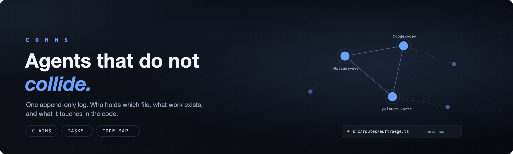
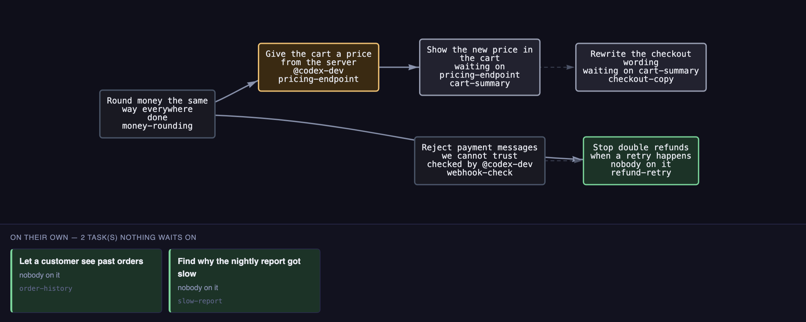
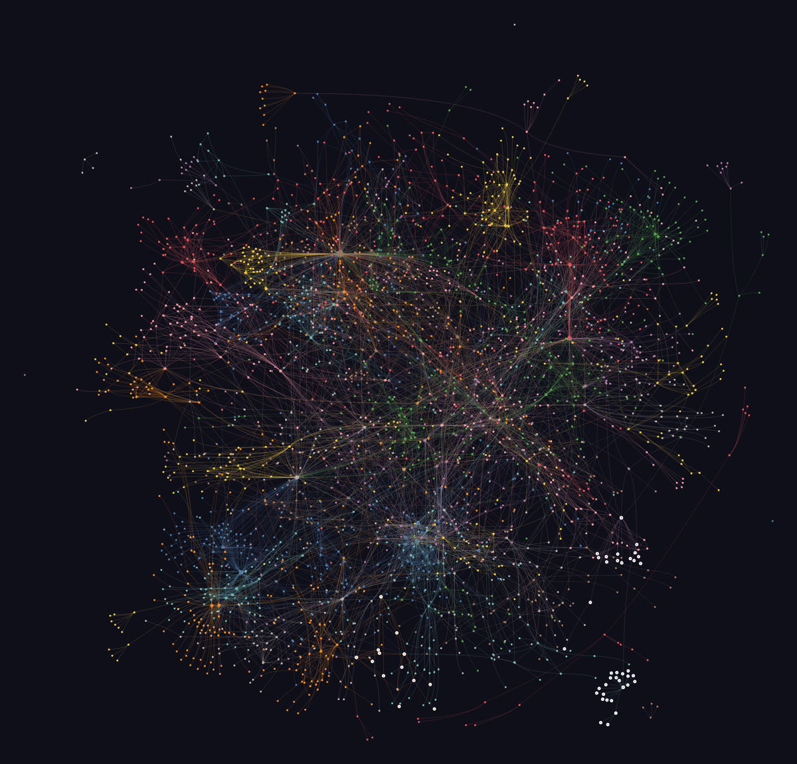
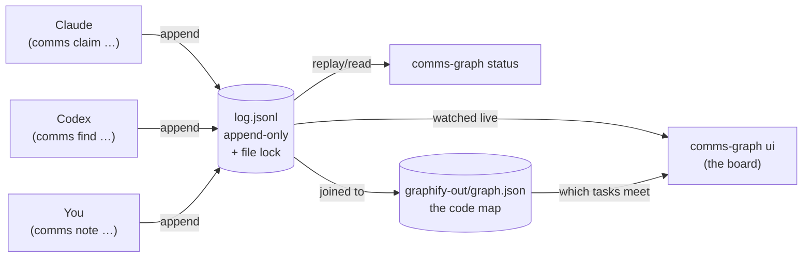

<div align="center">



[](https://github.com/dpa-plus/comms/actions/workflows/ci.yml)
[](https://github.com/dpa-plus/comms/releases)
[](LICENSE)
[](#two-builds-one-log)
[](#how-it-works)

</div>

Run two coding agents on one repository and they will edit the same file within
minutes of each other. Not because they are careless. Because nothing tells them
the file is taken.

comms is the thing that tells them. An agent **claims** a file before it edits.
A hook refuses an edit on somebody else's ground, and a git hook refuses a commit
that would take it. Everything is appended to one file on disk, and every view is
read back out of that file.

---

## Quick start

```bash
go install github.com/dpa-plus/comms/cmd/comms@latest
```

```bash
COMMS_ACTOR=codex-dev comms hello --label "Codex Dev"
COMMS_ACTOR=codex-dev comms claim "src/foo.ts" --intent "fix the double-counting bug"
COMMS_ACTOR=codex-dev comms status
```

Then, in each repo you want protected:

```bash
comms-graph guard install               # refuse a commit that takes somebody else's work
COMMS_ACTOR=human-you comms-graph ui    # the board, at http://127.0.0.1:7878
```

[`docs/INSTALL.md`](docs/INSTALL.md) covers the pre-edit hook, the agent skill,
and running the board as a login service.

---

## What it buys you beyond a lock

Because the log records what each agent was doing and which files it took, comms
answers questions a lock cannot:

| Question | Answered by |
|---|---|
| Who is holding this file right now? | the log, exactly |
| What work exists, and is any of it finished? | the task graph |
| Which files did that task actually touch? | claims tagged `--task` |
| Whose work sits next to mine in the code? | the task graph joined to the code map |
| Would this commit take somebody else's work? | `check --staged`, run for you by `guard install` |
| What is changed on disk that nobody declared? | `git status`, read by comms itself |

That last row matters more than it looks. Everything else here depends on an
agent choosing to declare something, and the measured behaviour is that they
often do not: the discipline lapses after a context compaction, and edits made
through a shell heredoc are invisible to the pre-edit hook by construction. So
comms reads `git status` itself and shows what is genuinely changed on disk next
to what was declared. It never guesses who made a change, because *we do not know
who did this* is the finding, not a gap to fill.

---

## The board

<p align="center">
  
</p>

```bash
COMMS_ACTOR=human-you comms-graph ui
```

One window for every comms project on the machine. It opens on what just
happened, newest first, with the things that need somebody pulled to the top.
Around that: who is holding which files, who is actually here, the tasks with the
files each one touches, and what is dirty in the tree that nobody claimed.

**It reads. It does not write**, with one exception: **Release**, which frees a
claim somebody else is holding. It asks for a reason and refuses without one,
because the release is recorded under your name permanently.

It updates by push, not polling, so when any agent appends an event the right
project lights up immediately. More in [`docs/DASHBOARD.md`](docs/DASHBOARD.md).

---

## The two graphs

The log answers *who is touching what*. It cannot answer *what is this work,
where does it live, and is any of it connected*. Two graphs do, and both are
built from things the agents were already doing.

<p align="center">
  
</p>

**The task graph is built out of claims.** An agent declares a task, then claims
files with `--task <id>`. That flag is the only bookkeeping in the whole tool
that is not derived for you, and it is one word on a command you were running
anyway. In return the board can open a task and show what it is, whether somebody
*other than the author* checked it, and every file it touched.

A solid arrow means the target consumes something from the source, so reworking
the source puts the target back in question. A dashed arrow is ordering only.
Tasks nothing waits on are listed underneath rather than drawn, because a node
with no edges is not a graph. It is a list, and a list can be read.

<p align="center">
  
</p>

**The code map is built by [graphify](https://pypi.org/project/graphifyy/)**,
which reads the repository into a graph of files, symbols and the edges between
them. Above is this repository: 2,924 nodes, 7,169 edges, coloured by community,
with the ones somebody holds a claim on right now picked out in white. That
overlay is the join: the map knows the structure, the log knows who is standing
where.

```bash
graphify extract . --code-only     # local AST, no API key
```

Two limits, both measured rather than assumed. The map misses between a third and
a half of the file pairs that really do change together, so **silence from it is
weak evidence, not a clear signal**. And of the pairs it does flag, well under
half turn out to matter. It is a prompt to look, never a verdict.

---

## What comms gives you

| Primitive | What it's for | Example |
|---|---|---|
| **Claim** | "I'm working on this file, hands off." Several at once is atomic. | `comms-graph claim src/auth.ts src/login.ts --intent "rework auth"` |
| **Task** | What the work IS. Claims tagged to it become its file list. | `comms-graph task add auth-api --title "Let people stay signed in"` |
| **Finding** | A durable fact: a bug, a fix, a decision, a gotcha, a release. | `comms-graph find decision "tracker is source of truth for leads"` |
| **Note** | A short, throwaway heads-up. | `comms-graph note "FYI: schema migration coming next"` |
| **Session** | A named work window that groups claims and can be archived. | `comms-graph session start "dashboard fixes"` |
| **Doc** | A small per-repo wiki under `.comms/docs`. | `comms-graph doc tracker-architecture` |
| **Lesson** | Cross-project knowledge that outlives any one repo. | `comms-graph lesson verify-data-before-ui` |

---

## Teach your agents to use it

comms ships a **skill** that teaches an agent the protocol: when to claim, what
to record, how to coordinate, how to recover. The same file works for Claude and
Codex.

```bash
cp -r skills/using-comms ~/.claude/skills/    # Claude
cp -r skills/using-comms ~/.codex/skills/     # Codex
```

The agent follows it whenever you say **`using-comms`**.

---

## How it works

**comms is not a server.** No daemon, no network service, no database. It is a
command-line tool that appends to a file and exits.

The agents never talk to each other. They use a shared whiteboard: one writes a
claim, another reads it back and works elsewhere. Conflicts are caught by
reading, not by messaging.

```
your-repo/.comms/                        <- committed to git
  policy.txt                              optional rules: which paths need claims
  docs/                                   the per-repo wiki

~/Library/Application Support/comms/<repo-hash>/   <- per-machine, not in git
  log.jsonl                               the append-only event log
  .lock                                   serializes writes
```

Every command is the same small dance: find the repo's log, take the file lock,
append one JSON line, release, exit. Reading state replays the log and takes no
lock at all.


```mermaid
flowchart LR
    A["Claude<br/>(comms claim …)"] -- append --> L[("log.jsonl<br/>append-only<br/>+ file lock")]
    B["Codex<br/>(comms find …)"] -- append --> L
    C["You<br/>(comms note …)"] -- append --> L
    L -- replay/read --> D["comms-graph status"]
    L -- watched live --> U["comms-graph ui<br/>(the board)"]
    L -- joined to --> G[("graphify-out/graph.json<br/>the code map")]
    G -- which tasks meet --> U
```

A claim goes **stale after 1 hour idle** and can then be taken over directly. A
still-active claim needs your confirmation and a reason.

---

## Commands at a glance

```
comms hello [<name>] [--label "Claude Dev"] [--model … --vendor …]
comms claim "<scope>" ["<scope>" ...] --intent "<text>" [--task <slug>] [--steal <id>]
comms release [<id> ...|--latest|--all-mine] [--result "<text>"]
comms status [--json]
comms board                                   who holds what, and what is dirty
comms log [--actor X] [--since 1h] [--scope path] [--type list]
comms note [--priority] "<=200-char FYI>"
comms find [--priority] <bug|fix|ship|decision|gotcha> "<summary>" [--ref kind:value]

comms task add <slug> --title "<plain English, for a person>" [--review] [--check test]
comms task edge <from> <to> --kind consumes|sequence --provides "<what it uses>"
comms task done <slug> [--check test=pass] [--note "<a decision you made>"]
comms task review <slug> --pass | --fail --evidence "<how you checked>"
comms next                                    what you could pick up right now
comms brief <slug>                            what you inherit before starting
comms plan --from plan.json                   a whole decomposition, or nothing

comms check <path>                            pre-edit hook; exits 2 to block
comms check --staged                          commit guard
comms-graph guard install [--chain]           make the commit guard run on every commit
comms ui [--addr host:port] [--no-open]        the dashboard (served by comms-graph)
comms mcp                                     the same verbs as MCP tools over stdio

comms session start|join|end "<name>"
comms session retire <actor> [--reason "..."]  remove from the roster, release its claims
comms session lead [<actor>]
comms doc --list | comms doc <slug> [--edit]
comms lesson --list | comms lesson <slug> [--edit]

Global: --repo /absolute/path                 bypass cwd/git discovery
```

Use stable, readable actor names (`claude-dev`, `codex-dev`). If an agent
registers a throwaway one, **retire** it rather than editing the log.

---

## Design notes

- **Append-only, plus `flock`.** Writes are serialized by a per-repo file lock,
  and the log is never rewritten, so history and audit are free.
- **Recoverable.** Blank lines are skipped, a torn final line is ignored, and
  duplicate event IDs are dropped, so a half-written line never breaks a read.
- **Enforced, if you wire it up.** Nothing installs itself. But the `PreToolUse`
  hook exits 2, the only code Claude Code treats as "block this tool call", and
  it fails closed.
- **The hook cannot see Bash.** An edit made with `sed` or a heredoc never
  reaches it, and in agent auto-modes Bash is the default, so this is the normal
  case rather than a corner. Measured on one real session: ~35 edits, the hook
  fired zero times. `guard install` is the backstop a heredoc cannot argue with.

More in [`docs/DESIGN.md`](docs/DESIGN.md) and [`docs/PROTOCOL.md`](docs/PROTOCOL.md).

---

## Two builds, one log

This repository holds two builds, and they are not a port and its original. They
run side by side against the same store, read each other's events, and block each
other's claims.

- **Go**, everything outside `python/`, installed as `comms`.
- **Python**, [`python/`](python/README.md), installed as `comms-graph`. Adds the
  task graph, the code map, and the board. `comms ui` hands the dashboard to
  it rather than serving a second one.

Because the log is the interface, moving a hook from one to the other is a
one-line change. Both are covered by [CI](.github/workflows/ci.yml).

---

## License

[MIT](LICENSE).
